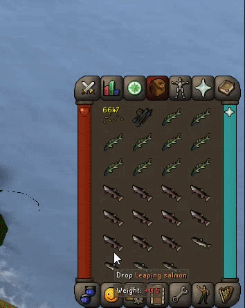

# Drop Trainer

Drop Trainer turns full-inventory dropping into an arcade-style reflex game for RuneLite.

## Features
- Guided next-click targets for configured inventory items
- Score, combo, miss punishment, and live rank tracking
- Difficulty presets: Easy, Medium, and Hard
- Loud dopamine mode with hit flashes and a results screen
- Arcade-style end screen with rank, combo, misses, and timing stats

## Configuration
Set `Drop item names` to a comma-separated list such as `Leaping trout, Leaping sturgeon, Leaping salmon`.
The trainer activates when your inventory is full and matching items are present.

## How It Works
- Fill your inventory with the configured items.
- The overlay activates when your inventory is full.
- Follow the highlighted drop path as quickly and accurately as possible.
- Faster, cleaner runs score higher and earn better ranks.
